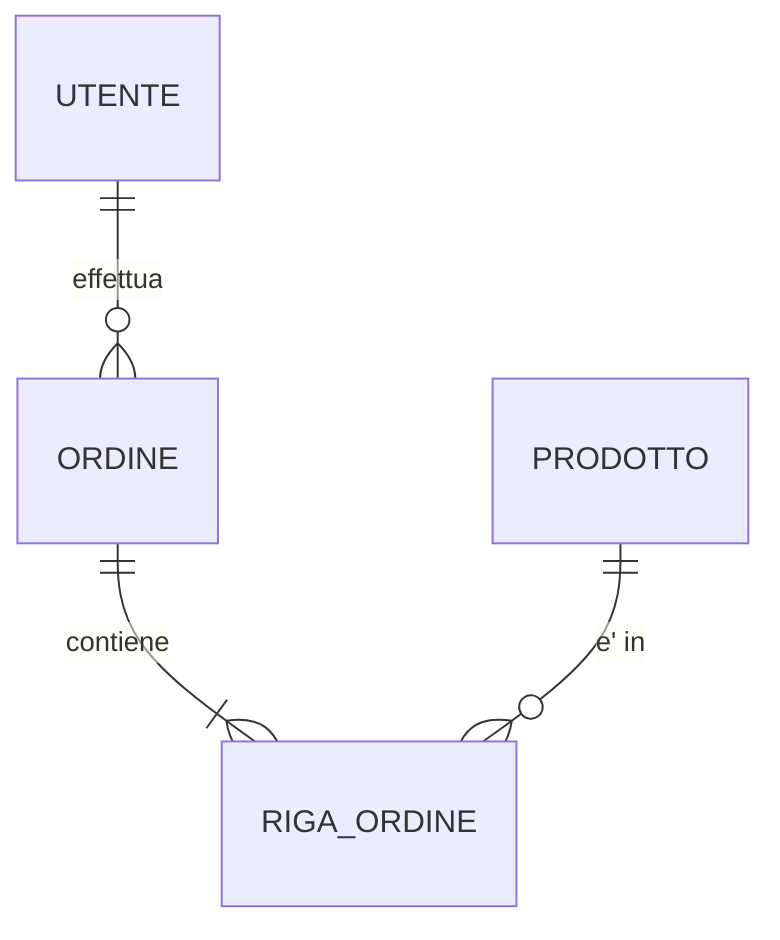

# Template — SCHEMA_REFERENCE.md (BAM Appendice A.7)

Formalizza la struttura della persistenza usando DBML per la definizione dichiarativa
e Mermaid erDiagram per la visualizzazione delle relazioni.

## Struttura

```markdown
# Schema Reference — <nome progetto>

---

## 1. Diagramma ER

<!-- Diagramma delle relazioni in formato Mermaid,
     renderizzabile direttamente in GitHub/GitLab. -->



---

## 2. Definizione Tabelle (DBML)

<!-- Definizione dichiarativa completa in DBML.
     Ogni tabella include: colonne, tipi, vincoli, indici, note.
     La definizione DBML e' la fonte autoritativa. -->

```dbml
Table utente {
  id bigint [pk, increment]
  email varchar(255) [unique, not null, note: 'Email di accesso']
  nome varchar(100) [not null]
  created_at timestamp [default: `now()`]

  indexes {
    email [unique]
  }

  note: 'Anagrafica utenti del sistema'
}

Table ordine {
  id bigint [pk, increment]
  utente_id bigint [ref: > utente.id, not null]
  stato varchar(20) [not null, note: 'BOZZA | CONFERMATO | SPEDITO | CHIUSO']
  totale numeric(12,2) [not null]
  created_at timestamp [default: `now()`]

  indexes {
    utente_id
    (utente_id, stato) [name: 'idx_utente_stato']
  }
}
```

---

## 3. Dettaglio per Tabella

<!-- Per ogni tabella, informazioni non esprimibili in DBML:
     volume, partizionamento, note operative. -->

### <nome_tabella>

**Volume stimato**: <N record>
**Strategia partizionamento**: <se applicabile>
**Note operative**: <vincoli di business, regole di cancellazione, ecc.>
```

## Regole

- Il diagramma Mermaid e' obbligatorio e deve rappresentare tutte le relazioni tra entita'.
- La definizione DBML e' la fonte autoritativa per colonne, tipi, vincoli e indici.
- Per ogni tabella con volume significativo (> 10k record), indicare il volume stimato e la strategia di indicizzazione.
- Le note DBML (`note:`) devono descrivere il significato di business del campo, non il tipo tecnico.
- La sezione "Dettaglio per Tabella" e' riservata a informazioni non esprimibili in DBML (volume, partizionamento, regole operative).
