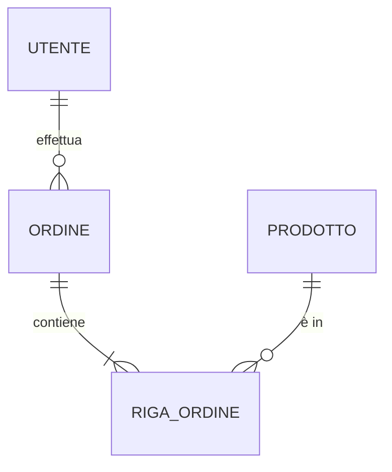

# Blueprint Agentic Development

**Autore:** Mattia Costantini (Rancor)
**Affiliazione:** Senior Architect, Firstance s.r.l.
**Contatto:** rancorow@gmail.com
**Versione:** Draft

---

## Abstract

Il presente lavoro introduce il paradigma ***Blueprint Agentic Development*** (BAD), un processo metodologico per lo sviluppo software assistito da Agenti di intelligenza artificiale generativa.
Il paradigma si fonda sul principio che la documentazione tecnica, strutturata secondo standard ingegneristici consolidati, costituisca la **fonte epistemica primaria (*single source of truth*)**
a partire dalla quale gli Agenti AI generano il codice sorgente in modo autonomo e verificabile.

Il processo si articola in quattro fasi — **Brainstorming**, **Analisi e Design**, **Definizione del Contratto**, **Planning** — ciascuna delle quali produce un insieme di artefatti documentali che fungono da vincoli deterministici.
La conformità del codice prodotto non è garantita dalla revisione umana (***code review***), bensì dalla validazione tramite ***acceptance test***, ***system test*** e ***integration test*** derivati direttamente dalle specifiche.

Il contributo si colloca nel contesto della letteratura emergente sul ***Vibe Coding*** (A. Karpathy, 2025) e sull'***Agentic Coding***, proponendo una declinazione strutturata e orientata al controllo ingegneristico di tali paradigmi.

**Parole chiave:** ***Behavior-Driven Development, Agenti AI, Spec-Driven Development, Spec-as-Source, Docs-as-Code, Agentic Coding, Vibe Coding, Waterfall, V Model, intellectual debt, Comunicazione Non Violenta, Comunicazione Assertiva***

---

## 1. Introduzione

A differenza del ***V Model*** o del ***Waterfall***, il processo ***BAD*** opera su un paradigma di **Sintesi Comportamentale**:
il **blueprint** costruito in sinergia con l'AI funge da specifica immutabile per gli Agenti che, in piena autonomia, generano il codice.

Il design segue il solco tracciato dai paradigmi «***Spec-Driven Development***» (SDD) e «***Behavior-Driven Development***»,
proponendo una loro integrazione in scenari dove il controllo e la verifica dei dettagli implementativi rivestono un'importanza centrale. 

Partendo dal concetto di «*Docs-as-Code*», dove la documentazione vien gestita allo stesso livello del codice (sotto versioning e inserita in pipeline CI/CD) e rappresenta i vincoli architetturali,
la si elegge a **fonte epistemica degli Agenti AI**; lo scopo ultimo è quello di raggiungere un modello «*Spec-as-Source*» in cui si elimina la necessità di *code review*
e la garanzia sulla conformità è delegata alla validazione di *acceptance test*, *system test* e *integration test*.

---

## 2. Scenario

La scrittura del codice, che fino a oggi è stata di pieno dominio del programmatore, viene ora demandata ad algoritmi di generazione di testo. Questo apre importanti temi:

- la **fiducia** nello strumento e nel codice che esso produce;
- la mitigazione del **debito intellettuale** (intellectual debt);
- la **flessibilità**, intesa come capacità di evolvere nel tempo (modifica, estensione);
- il **costo**, sia implementativo che di scalabilità.

Ciò porta alla definizione di un processo operativo chiaro, dettagliato e verificabile per colmare il divario tra l'intelletto umano e la potenza artificiale.
Come già introdotto da (Sapkota et al., 2025), si tratta di un nuovo **layer semiotico** che trasforma la documentazione nel ***single source of truth***.

I concetti su cui si vuole porre l'accento, nel sistema BAD, sono:

- **Comprensione reciproca**; il primo obiettivo da traguardare è la comprensione reciproca dell'attività da svolgere. Non si accetta il primo risultato come definitivo, ma si procede a un affinamento **iterativo**.
Alcuni degli strumenti che possono essere di supporto in questa fase sono la ***Comunicazione Non Violenta*** o la ***Comunicazione Assertiva***.
- **Contesto deterministico**: l'AI risponde sempre e non si rifiuta mai di fornire una soluzione a un problema; questo comportamento potrebbe essere fuorviante e pericoloso. 
Fornire un contesto limitato, preciso e univoco riduce le **«allucinazioni»** e le risposte arbitrarie. La suddivisione in file tematici orienta l'algoritmo in questa direzione.
- **Tracciabilità del pensiero**: documentare non solo il *cosa*, ma il *perché* di ogni scelta.
Questo aiuta la focalizzazione degli Agenti nel traguardare gli obiettivi di *business* e nella generazione di scenari di test efficaci.

I modelli classici ***IEEE/ISO***, che prevedono documenti monolitici, pur mantenendo una loro validità concettuale, devono evolvere per accogliere le specificità del contesto attuale.

---

## 3. Fase di Brainstorming (Spec)

L'obiettivo è **ridurre** l'***entropia informativa*** (Shannon, C. E. 1948).
Gli Agenti AI sono eccellenti nel riempire i vuoti, spesso «allucinando» o prendendo decisioni arbitrarie e decontestualizzate.

A tal fine è necessario:

- **Eliminare le assunzioni**: forzare l'AI a dichiarare cosa non ha compreso invece di indovinare.
- **Creare un perimetro**: definire cosa il software deve e, soprattutto, cosa non deve fare.
- **Raggiungere una comprensione reciproca**: come tra umani, anche con l'AI la comprensione è frutto di un processo congiunto e iterativo.

Nello sviluppo tradizionale, il costo di una scelta architetturale errata o la mancata previsione di uno scenario operativo è tanto più alto quanto più si è avanti nella scrittura del codice.
Operando con Agenti AI, questo peso è ancora più marcato, sia per la quantità di codice prodotto in pochi istanti, sia per la perdita di visibilità e controllo intrinseco.

### 3.1 Il Protocollo Operativo

Il processo di allineamento segue un **ciclo iterativo «Socratico»**:

1. **Enunciazione del progetto (`PROJECT.md`)**: viene enuncia l'idea iniziale; non è necessario essere tecnici, è necessario essere **chiari sugli obiettivi di *business*,
l'esperienza utente, il contesto applicativo e operativo**. È utile introdurre esempi pratici tratti da contesti realistici.
2. **Analisi critica dell'AI**: l'AI non deve limitarsi ad accettare il *brief*; deve analizzarlo cercando lacune logiche, conflitti tra requisiti o ambiguità terminologiche.
3. **Il loop di QA (`AQ_ITERATIONS.md`)**: l'AI pone una serie di domande mirate ad aumentare la definizione e comprensione del progetto; sia domande che risposte devono essere tracciate.
Questo processo continua finché l'AI non dichiara di avere una «comprensione ad alta confidenza». A questo passaggio va dedicata la massima attenzione, in quanto sarà cruciale per l'intero flusso di lavoro successivo.
4. **Sintesi operativa (`PROJECT.md`)**: una volta esaurite le domande e dipanate le incertezze, si procede ad aggiornare il documento di progetto con tutti i dettagli emersi.

| File               | Scopo                                                                            | Standard / Riferimento    |
|--------------------|----------------------------------------------------------------------------------|---------------------------|
| `PROJECT.md`       | Visione di alto livello e obiettivi del *business*.                              | *Product Vision Template* |
| `AQ_ITERATIONS.md` | Log storico dei chiarimenti tra umano e AI. Evita di ripetere domande già fatte. | **BAD — Appendice A.1**   |

---

## 4. Fase di Analisi e Design

Questa fase rappresenta la transizione dalla comprensione del dominio alla **definizione del *blueprint* architettonico**. Nel **workflow AI-driven**, questa sezione funge da **«vettore di vincoli»**:
limita il campo d'azione dell'intelligenza generativa all'interno di parametri ingegneristici precisi, garantendo che il codice prodotto non sia solo funzionale, ma anche manutenibile e scalabile.

Un altro elemento centrale è la mitigazione del ***debito intellettuale***: mancando una conoscenza diretta del codice sorgente,
diventa fondamentale che la documentazione da cui esso verrà generato sia chiara e di facile consultazione.

Si vuole porre una particolare attenzione a:

- **Ridurre arbitrarietà architetturale:** imporre *pattern* specifici (es. *Clean Architecture*, *Hexagonal*, *SOLID*) per evitare che l'AI generi soluzioni «monolitiche» o disordinate.
- **Validazione deterministica:** fornire criteri di accettazione che possano essere utilizzati per test automatici e validazione del codice generato.
- **Chiarezza e leggibilità**: sfruttare linguaggi di *markup* con tabelle e grafici esplicativi.

### 4.1 Il Protocollo Operativo

Il processo segue una sequenza logica di enunciazione delle specifiche:

1. **Inventario tecnologico e vincoli (`TECH_STACK.md`)**: si procede all'inventario delle dipendenze tecnologiche (*stack*, *framework*, *versioni*), dei requisiti
infrastrutturali e dei vincoli non funzionali (*performance*, *SLA*, *compliance*). Il linguaggio utilizzato segue le convenzioni **RFC 2119** (*MUST*, *SHOULD*, *MAY*) per esprimere l'obbligatorietà dei vincoli in modo formale e verificabile.
I principi infrastrutturali seguono le linee guida della ***Twelve-Factor App*** (Wiggins, 2011). Si noti che i requisiti funzionali non appartengono a questo documento, ma a `ACCEPTANCE_CRITERIA.md`; analogamente, le scelte architetturali sono documentate in `ADR/`. `TECH_STACK.md` è il riferimento esclusivo per *cosa* compone il sistema e *quali vincoli* deve rispettare.
2. **Definizione degli *acceptance criteria* (`ACCEPTANCE_CRITERIA.md`)**: ogni requisito funzionale viene tradotto in clausole logiche utilizzando la sintassi **EARS(*Easy Approach to Requirements Syntax*)** come suggerito della documentazione di Amazon Kiro. Questa sarà poi la base per la generazione di test efficaci.
3. **Registrazione delle decisioni architetturali (`ADR/`)**: *(opzionale)* per ogni bivio tecnologico (es. scelta del motore di *database*, strategia di autenticazione), l'AI produce un ***Architecture Decision Record***. Ogni ADR documenta il contesto, le alternative scartate e le conseguenze della scelta, seguendo il formato di Nygard (2011).
4. **Consistenza semantica (`GLOSSARIO.md`)**: viene stabilito il **Linguaggio Ubiquitario (DDD)** nel Glossario per evitare che l'AI utilizzi sinonimi diversi per lo stesso concetto di *business* nel codice (Evans, 2003).
5. **Osservabilità (`LOGGING_STRATEGY.md`)**: viene definita la strategia di *logging* per garantire che l'applicazione sia monitorabile secondo gli standard di **Observability** (formati JSON, livelli di severità, tracciamento delle transazioni).
6. **Descrizione dell'ambiente di test (`TEST_ENVIRONMENT.md`)**: questo documento specifica la strategia e l'architettura necessaria per eseguire i test. Descrive gli ambienti (unit, integration, system), i *server mock* necessari, le fonti dei dati di test e le configurazioni per ambiente.
Il formato è **descrittivo-tabellare**, progettato per essere leggibile da chi deve validare la strategia di test senza conoscere i dettagli implementativi *(Standard di riferimento: **BAD — Appendice A.6**)*.
7. **Scenari di rilascio (`DEPLOY.md`)**: descrive i processi che portano al rilascio operativo del progetto. Elenca i passaggi per l'installazione, la configurazione e l'implementazione.

Al termine di questa fase, il sistema deve aver generato un insieme di documenti che fungano da ***Single Source of Truth***.

Questa fase forza gli agenti a essere «**esecutori tecnici**» riducendo l'autonomia e il rischio di scelte arbitrarie e imprevedibili mantenendo alto il moltiplicatore di produttività che il paradigma promette (Meske et al., 2025).

| File                     | Scopo                                                                         | Standard / Riferimento           |
|--------------------------|-------------------------------------------------------------------------------|----------------------------------|
| `TECH_STACK.md`          | Inventario tecnologico, vincoli infrastrutturali e non funzionali.            | **RFC 2119 + Twelve-Factor App** |
| `ACCEPTANCE_CRITERIA.md` | Definizione di «fatto» per ogni *feature*, scritto in linguaggio strutturato. | **Standard EARS**                |
| `ADR/` (Cartella)        | Registro delle decisioni architettoniche (es. perché quel DB?).               | **Nygard ADR Format**            |
| `LOGGING_STRATEGY.md`    | Standard di osservabilità: formati, livelli e sicurezza dei *log*.            | **BAD — Appendice A.2**          |
| `GLOSSARIO.md`           | Allineamento terminologico (*Ubiquitous Language*).                           | **DDD (*Domain-Driven Design*)** |
| `TEST_ENVIRONMENT.md`    | Strategia di test, ambienti, *mock* e dati di test.                           | **BAD — Appendice A.6**          |
| `DEPLOY.md`              | *Pipeline* CI/CD e istruzioni per il rilascio.                                | *DevOps Best Practices*          |

---

## 5. Fase Contrattuale

La finalità primaria è la creazione di **contratti di interfaccia immutabili**. Lo scopo è fornire agli Agenti AI le specifiche di ogni risorsa, la descrizione dei dati e delle loro interazioni.

I rischi che si intende mitigare sono il **mismatch tra componenti**, la **ridondanza** e la **scarsa efficienza**.

Se nelle fasi precedenti è stata data enfasi alle scelte architetturali, il *focus* passa ora alla descrizione dei **dati**, della loro gestione e delle interazioni con i *client*.

- **Flusso informativo**: vengono descritte le fonti dei dati e le logiche di persistenza e di gestione.
- **Presentazione**: vengono elencate e descritte le API di interazione, sia quelle consumate che quelle esposte.
- **Criteri di accettazione**: viene dato agli agenti un criterio di accettazione del proprio lavoro, prima ancora che l'umano sia chiamato a validarlo. 

### 5.1 Il Protocollo Operativo

1. **Definizione dei contratti di interfaccia (`API_SPEC.md`)**: vengono descritte sia le interfacce consumate che quelle esposte. In uno scenario in cui si ha un'interazione tra *frontend* e un *backend*,
saranno descritti i punti di interazione e le logiche di utilizzo.
2. **Modellazione del dominio dati (`SCHEMA_REFERENCE.md`)**: viene formalizzata la struttura della persistenza utilizzando **DBML** (*Database Markup Language*) per la definizione dichiarativa delle tabelle, relazioni e indici, e **Mermaid erDiagram** per la visualizzazione dei diagrammi ER direttamente nel *Markdown*. Non si tratta solo di elencare tabelle, ma di descrivere le relazioni,
i vincoli di integrità referenziale, gli indici necessari per le *performance* e le strategie di partizionamento *(Standard di riferimento: **BAD — Appendice A.7**)*.
3. **Riferimento della logica di accesso (`QUERY_REFERENCE.md`)**: questo documento raccoglie le operazioni di lettura/scrittura più critiche o complesse.
Serve a descrivere come i dati devono essere estratti o aggregati, fornendo all'AI degli «esempi» tipici (*Gold Standard*) per evitare inefficienze e vulnus.
4. **Elenco globale dei test (`EXPLAIN_TEST.md`)**: In questo documenti vengono elencati tutti i test, suddivisi per area *unit*, *integration*, *system*, *acceptance*.
Serviranno, in prima istanza, agli Agenti per validare il processo di sviluppo e successivamente all'umano per accettare l'esito del progetto.

| File                  | Scopo                                                        | Standard / Riferimento  |
|-----------------------|--------------------------------------------------------------|-------------------------|
| `API_SPEC.md`         | Definizione degli *endpoint* e dei contratti di interfaccia. | **BAD — Appendice A.3** |
| `SCHEMA_REFERENCE.md` | Diagrammi ER (Mermaid) e definizione tabelle (DBML).         | **BAD — Appendice A.7** |
| `QUERY_REFERENCE.md`  | Esempi di *query* complesse e logica di persistenza.         | **BAD — Appendice A.4** |
| `EXPLAIN_TEST.md`     | Elenco ti tutti i test da prevedere per fase progettuale.    | **Standard BDD**        |

---

## 6. Fase di Pianificazione

A questo punto si è pronti per la **descrizione passo per passo del processo generativo**; nel modello SDD, si è giunti alla fine della fase si Spec.

Le logiche di base sono le seguenti:

1. **Competenza**: ogni Agente deve essere istruito con una competenza verticale specifica.
2. **Contesto**: il contesto operativo viene ritagliato in modo da dare la massima focalizzazione verso il risultato atteso.
3. **Granularità**: per garantire la parallelizzazione di più Agenti è necessario scegliere una suddivisione che minimizzi le dipendenze tra di essi.

Se, da un lato, una maggiore suddivisione in *micro task* porta a un'efficienza elevata sulle singole operazioni, dall'altro aumenta la difficoltà nell'integrazione dei diversi blocchi,
nel coordinamento dei processi e nella coerenza tra le diverse attività. Non trascurabile è anche l'aumento del consumo di *token*.

Ciò spinge a un bilanciamento tra **specializzazione** e **competenza**: dalla documentazione di Claude Code, il numero di Agenti che vengono automaticamente generati nun supera le venti unità.

### 6.1 Il Protocollo Operativo

1. **Sintesi operativa (`EXECUTION_PLAN.md`)**: l'operatività viene suddivisa in **sub-task atomici**, ciascuno specifico per ambito operativo. Ogni *task* sarà affidato a uno specifico Agente.
Il documento conterrà inoltre una suddivisione in fasi progettuali ben distinte, in modo da poter introdurre **checkpoint** progressivi durante la generazione.
2. **Overview (`README.md`)**: presentazione del progetto. Viene creato un **entry point** applicativo per fornire le istruzioni di base all'utente che deve consumare il progetto.

| File                | Scopo                                                                               | Standard / Riferimento       |
|---------------------|-------------------------------------------------------------------------------------|------------------------------|
| `EXECUTION_PLAN.md` | *Roadmap* tecnica per gli Agenti: chi fa cosa, quali *tool* e quali *plugin* usare. | **BAD — Appendice A.5**      |
| `README.md`         | Presentazione del progetto, *overview*, *setup* rapido.                             | *Standard De Facto* (GitHub) |

---

## 7. Workflow di Generazione

Il processo non è lineare, ma segue un flusso a «cascata controllata» con *feedback loop*.

```
1. INPUT          → L'umano fornisce il PROJECT.md
2. CHIARIMENTO    → L'AI interroga l'umano; i dubbi vengono risolti in AQ_ITERATIONS.md
                    (Passaggio iterativo fino ad esaurimento delle domande)
3. CONSOLIDAMENTO → Viene aggiornato PROJECT.md con i chiarimenti raggiunti
4. ESPLOSIONE     → Generazione automatica di tutti i documenti di specifiche:
                    TECH_STACK.md, ACCEPTANCE_CRITERIA.md, ADR/,
                    LOGGING_STRATEGY.md, GLOSSARIO.md, TEST_ENVIRONMENT.md,
                    DEPLOY.md, API_SPEC.md, QUERY_REFERENCE.md, SCHEMA_REFERENCE.md
5. PIANIFICAZIONE → L'AI redige l'EXECUTION_PLAN.md (ordine di marcia) e il EXPLAIN_TEST.md
6. VALIDAZIONE    → L'umano valida il piano e i test prima di avviare la generazione del codice.
7. ESECUZIONE     → Gli Agenti generano il codice basandosi sui documenti tecnici
8. FINALIZZAZIONE → Viene generato il README.md come sintesi di quanto realizzato
```
---

## 8. Successive evoluzioni

Al termine della generazione del progetto, si entra nella fase di evoluzione e mantenimento.

In caso si tratti di modifiche di minore entità, non sarà necessario rientrare nel flusso dalla fase di brainstorming, ma si potrà sfruttare un documento di changelog.

Rimane importante il concetto di **iterazione** e di **tracciabilità* per questo si avrà una nuova fase di analisi in cui vengono mantenuti due documenti:

| File               | Scopo                                                                            | Standard / Riferimento      |
|--------------------|----------------------------------------------------------------------------------|-----------------------------|
| `CHANGELOG.md`     | Modifiche richieste.                                                             | **Keep a Changelog**        |
| `AQ_ITERATIONS.md` | Log storico dei chiarimenti tra umano e AI. Evita di ripetere domande già fatte. | **BAD — Appendice A.1**     |

Terminata la quale si chiede agli Agenti di
1. Aggiornare la documentazione
2. Apportare le modifiche
3. Rieseguire i test

---

## 9. Bibliografia e Standard De Facto

### Standard e Riferimenti Normativi

1. Bradner, S. (1997). Key words for use in RFCs to Indicate Requirement Levels. *RFC 2119*. IETF. https://datatracker.ietf.org/doc/html/rfc2119
2. Mavin, A., Wilkinson, P., Harwood, A., & Novak, M. (2009). Easy approach to requirements syntax (EARS). In *Proceedings of the 17th IEEE International Requirements Engineering Conference (RE'09)*, pp. 317–322. IEEE.
3. Nygard, M. T. (2011). Documenting architecture decisions. *Cognitect Blog*. https://cognitect.com/blog/2011/11/15/documenting-architecture-decisions
4. Wiggins, A. (2011). *The Twelve-Factor App*. https://12factor.net
5. Evans, E. (2003). *Domain-Driven Design: Tackling Complexity in the Heart of Software*. Addison-Wesley, Boston, MA.
6. Google. (2024). *Google Developer Documentation Style Guide*. https://developers.google.com/style
7. Anthropic. (2025). *Claude Code overview*. Anthropic Documentation. https://docs.anthropic.com/en/docs/claude-code/overview
8. Sarkar, A., & Drosos, I. (2025). Vibe coding: Programming through conversation with artificial intelligence. In *Proceedings of the 36th Annual Conference of the Psychology of Programming Interest Group (PPIG 2025)*. arXiv:2506.23253. https://doi.org/10.48550/arXiv.2506.23253
9. Meske, C., Hermanns, T., von der Weiden, E., Loser, K.-U., & Berger, T. (2025). Vibe coding as a reconfiguration of intent mediation in software development: Definition, implications, and research agenda. *IEEE Access*, 13, pp. 213242–213259. https://doi.org/10.1109/ACCESS.2025.3645466
10. Sapkota, R., Roumeliotis, K. I., & Karkee, M. (2025). Vibe coding vs. Agentic Coding: Fundamentals and practical implications of Agentic AI. *arXiv preprint* arXiv:2505.19443. https://doi.org/10.48550/arXiv.2505.19443
11. Pimenova, V., Fakhoury, S., Bird, C., Storey, M.-A., & Endres, M. (2025). Good vibrations? A qualitative study of co-creation, communication, flow, and trust in vibe coding. *arXiv preprint* arXiv:2509.12491. https://doi.org/10.48550/arXiv.2509.12491
12. Zhang, A. L., Kraska, T., & Khattab, O. (2025). Recursive language models. *arXiv preprint* arXiv:2512.24601. https://doi.org/10.48550/arXiv.2512.24601
13. Eric Holscher & the Write the Docs community. https://www.writethedocs.org/guide/docs-as-code/
14. Zittrain, J. (2022). "Intellectual Debt". In The Cambridge Handbook of Responsible Artificial Intelligence. Cambridge University Press.
15. Shannon, C. E. (1948). A Mathematical Theory of Communication. *Bell System Technical Journal*, 27(3), pp. 379–423.
16. Keep a Changelog. https://keepachangelog.com/en/1.1.0/
17. Preston-Werner, T. (2013). *Semantic Versioning 2.0.0*. https://semver.org
18. Pichler, R. (2010). *Agile Product Management with Scrum: Creating Products that Customers Love*. Addison-Wesley.
19. DBML — Database Markup Language. *dbml-lang*. https://dbml.dbdiagram.io/docs/
20. Mermaid. *Mermaid — Diagramming and charting tool*. https://mermaid.js.org/syntax/entityRelationshipDiagram.html

---

## Appendice — Template dei formati proprietari BAD

I seguenti template descrivono la struttura dei file che non seguono uno standard normativo esterno
ma adottano un formato proprietario definito all'interno del paradigma *Blueprint Agentic Development*.
Per ogni template sono indicati: lo scopo, la struttura attesa, le convenzioni di naming e un esempio commentato.

---

### A.1 — `AQ_ITERATIONS.md` (Iterazioni Domande & Risposte)

**Scopo**: tracciare il dialogo iterativo tra l'umano e l'AI durante la fase di Brainstorming (§3).
Ogni domanda-risposta viene registrata per evitare ridondanze nelle sessioni successive e per documentare il processo decisionale.

**Struttura**:

```markdown
# Iterazione Domande & Risposte

Progetto: **<nome progetto>** — <descrizione breve>
Documento di riferimento: `PROJECT.md`

---

## Iterazione <N> — <Titolo descrittivo della sessione>

<!-- Le domande sono raggruppate per AREA tematica.
     Ogni area ha un identificativo a lettera (A, B, C, ...).
     Le aree servono a organizzare le domande per argomento,
     facilitando la consultazione successiva. -->

### AREA <LETTERA> — <Nome area tematica>

<!-- Tabella con colonne fisse: ID, Domanda, Risposta, Stato.
     - ID: formato <LETTERA>.<NUMERO> (es. A.01, B.03)
     - Domanda: formulata dall'AI, specifica e contestualizzata
     - Risposta: fornita dall'umano, riportata testualmente
     - Stato: RISOLTO | APERTO | RIMANDATO -->

| ID   | Domanda | Risposta | Stato   |
|------|---------|----------|---------|
| A.01 | ...     | ...      | RISOLTO |
| A.02 | ...     | ...      | APERTO  |
```

**Regole**:
- Le iterazioni sono numerate progressivamente (1, 2, 3, ...) e corrispondono a sessioni di lavoro distinte.
- Una nuova iterazione viene aperta quando si riprende il dialogo dopo una pausa o un aggiornamento significativo del `PROJECT.md`.
- Le domande con stato `APERTO` devono essere riprese nella successiva iterazione.
- Le risposte dell'umano vanno riportate *verbatim*, senza riformulazione da parte dell'AI.
- Le domande devono citare i riferimenti specifici (nomi di file, righe di codice, sezioni del `PROJECT.md`) per evitare ambiguità.

---

### A.2 — `LOGGING_STRATEGY.md` (Strategia di Logging)

**Scopo**: definire in modo univoco i canali, i formati e le regole di logging dell'applicazione.
Fornisce agli Agenti AI le specifiche per implementare il logging in modo coerente e sicuro.

**Struttura**:

```markdown
# Strategia di Logging — <nome progetto>

Formato di riferimento: **Structured JSON Logging**

---

## 1. Livelli di log

<!-- Tabella con i livelli di severità utilizzati nel progetto.
     Ogni livello ha un uso specifico e un esempio concreto.
     I livelli seguono la convenzione PSR-3 / Syslog. -->

| Livello   | Uso                                    | Esempio                            |
|-----------|----------------------------------------|------------------------------------|
| `ERROR`   | Errore che impedisce il completamento  | Query fallita, connessione persa   |
| `WARNING` | Situazione anomala ma gestita          | Conflitto su INSERT, limite vicino |
| `INFO`    | Azione di business completata          | Record inserito, operazione OK     |
| `DEBUG`   | Dettaglio tecnico (solo sviluppo)      | SQL eseguito, parametri request    |

---

## 2. Canali di log

<!-- Ogni canale descrive DOVE finisce il log e QUANDO viene scritto.
     Per ogni canale: nome, destinazione, condizione di attivazione,
     formato del record (con esempio JSON). -->

### 2.1 <Nome canale> (<destinazione>)

**Canale**: <destinazione tecnica (tabella DB, stderr, file, ecc.)>
**Quando**: <condizione di attivazione>
**Formato record**:

<!-- Esempio JSON del record di log -->
```json
{
  "campo1": "valore",
  "campo2": "valore"
}
```

**Regole**:
- < regola specifica del canale >

---

## 3. Formato risposta <protocollo>

<!-- Se l'applicazione espone API, descrivere il formato
     standard delle risposte (successo/errore). -->

---

## 4. Sicurezza dei log

<!-- Tabella con le regole di sicurezza da applicare ai log.
     Ogni regola ha la sua applicazione concreta. -->

| Regola                              | Applicazione                          |
|-------------------------------------|---------------------------------------|
| Mai loggare credenziali o password  | <come viene garantito>                |
| Sanitizzare output in produzione    | <meccanismo di controllo>             |

---

## 5. Retention

<!-- Politica di conservazione per ogni canale. -->

| Canale         | Retention                             |
|----------------|---------------------------------------|
| <canale>       | <durata o politica>                   |
```

**Regole**:
- Ogni canale di log deve avere un esempio JSON concreto del formato record.
- Le regole di sicurezza devono indicare *come* vengono applicate, non solo *cosa* è vietato.
- La sezione Retention è obbligatoria per ogni canale.

---

### A.3 — `API_SPEC.md` (Specifica API Endpoint-Action)

**Scopo**: documentare tutti gli *endpoint* esposti dal *backend*, con parametri, risposte attese e logica.
Rappresenta il contratto di interfaccia tra *frontend* e *backend*.

**Struttura**:

```markdown
# Specifica API — <nome progetto>

Formato: **Endpoint-Action Reference**

---

## 1. Convenzioni generali

### 1.1 Base URL

<!-- Indicare il pattern di base per tutti gli endpoint -->

### 1.2 Formato richiesta

<!-- Descrivere i metodi HTTP supportati e i content-type -->

### 1.3 Formato risposta

<!-- Definire la struttura JSON standard per successo, errore
     e stati speciali (es. 403 Forbidden). Includere esempi. -->

**Successo** (HTTP 200):
```json
{
  "success": true,
  "data": <mixed>
}
```

**Errore** (HTTP 400/500):
```json
{
  "success": false,
  "message": "Descrizione leggibile"
}
```

---

## <N>. <Nome modulo> — <file endpoint>

<!-- Per ogni gruppo logico di endpoint, una sezione dedicata -->

### <N.M> <METHOD> ?action=<action> — <Descrizione>

<!-- Per ogni endpoint:
     1. Parametri in tabella (Nome, Tipo, Obbligatorio, Descrizione)
     2. Risposta attesa con esempio JSON
     3. Logica backend (passi numerati) -->

**Parametri**:

| Nome   | Tipo   | Obbligatorio | Descrizione           |
|--------|--------|--------------|-----------------------|
| `nome` | string | Si           | Descrizione parametro |

**Risposta** (`data`):
```json
{ "campo": "valore" }
```

**Logica backend**:
1. <Passo 1>
2. <Passo 2>
```

**Regole**:
- Ogni *endpoint* deve avere almeno un esempio JSON di risposta.
- I parametri obbligatori devono essere esplicitamente marcati.
- La logica *backend* è descritta in passi numerati; se coinvolge transazioni atomiche, specificarlo.
- I campi nascosti (es. `id` presenti nei dati ma non visibili all'utente) devono essere documentati con una nota esplicita.

---

### A.4 — `QUERY_REFERENCE.md` (Riferimento Query SQL)

**Scopo**: documentare le *query* SQL critiche o complesse dell'applicazione.
Fornisce agli Agenti AI esempi *Gold Standard* per la generazione del codice di persistenza.

**Struttura**:

```markdown
# Query Reference — <nome progetto>

<!-- Descrizione introduttiva: scopo del documento e struttura. -->

---

## <N>. <Nome modulo/operazione>

### <ID-QUERY>: <Titolo descrittivo>

<!-- ID univoco con formato: Q-<MODULO>-<NUMERO>
     Es: Q-NRC-01, Q-FA-03, Q-LOG-01 -->

**Scopo**: <cosa fa la query>
**Tabella**: <tabella/e coinvolta/e> (<volume approssimativo>)
**Tipo**: <SELECT | INSERT | UPDATE | DELETE> <con particolarità: JOIN, LIKE, ON CONFLICT, ecc.>

```sql
-- Statement SQL completo con named parameters (:nome_parametro)
SELECT colonna
  FROM schema.tabella
 WHERE condizione = :parametro;
```

<!-- Tabella parametri con tipo ed esempio concreto -->

| Parametro    | Tipo   | Esempio    | Note                      |
|--------------|--------|------------|---------------------------|
| `:parametro` | string | `'valore'` | Descrizione del parametro |

**Performance**: <note su indici, volume dati, LIMIT, ecc.>

**Note**: <logica applicativa, vincoli, avvertenze>

<!-- Per query transazionali: indicare quali query devono
     essere eseguite in un'unica transazione atomica. -->
```

**Regole**:
- Ogni *query* ha un ID univoco nel formato `Q-<MODULO>-<NUMERO>` (es. `Q-NRC-01`).
- Lo *statement* SQL deve usare *named parameters* (`:nome`), mai valori *hardcoded*.
- Il volume approssimativo delle tabelle coinvolte va indicato per orientare le scelte di performance.
- Le *query* che devono essere eseguite in un'unica transazione devono essere esplicitamente raggruppate con una nota transazionale.
- Le note di *performance* (indici, `LIMIT`, partizionamento) sono obbligatorie per *query* su tabelle con volume significativo.

---

### A.5 — `EXECUTION_PLAN.md` (Piano di Esecuzione Multi-Agentico)

**Scopo**: definire la *roadmap* operativa per gli Agenti AI che eseguiranno la generazione del codice.
Suddivide il lavoro in fasi, assegna ogni *task* a un Agente specifico e stabilisce dipendenze e checkpoint.

**Struttura**:

```markdown
# <nome progetto> — Piano di Esecuzione Multi-Agentico

**Goal:** <obiettivo complessivo del piano>

**Architecture:** <sintesi dell'architettura in una frase>

**Tech Stack:** <elenco delle tecnologie>

---

## Mappa delle Fasi e Dipendenze

<!-- Diagramma ASCII che mostra le fasi (Phase 1, 2, ...)
     e le relazioni tra Agenti.
     Legenda: → = sequenziale, ║ = parallelo -->

```
Phase 1: <NOME> ──────────────────────
  Agent 1 (<SIGLA>)  →  Agent 2 (<SIGLA>)
                              │
Phase 2: <NOME> ────────────┬─┴─┬─────
  Agent 3 (<SIGLA>) ║ Agent 4 (<SIGLA>)
```

---

## Phase <N>: <Nome fase>

### Agent <N> — <SIGLA>

<!-- Tabella proprietà dell'Agente -->

| Proprietà        | Valore                                      |
|-------------------|---------------------------------------------|
| **Modello**       | <haiku | sonnet | opus>                     |
| **Tipo**          | <descrizione del tipo di lavoro>            |
| **Dipendenze**    | <Agent N completato | Nessuna>              |
| **Durata stimata**| <stima temporale>                           |

**Docs da leggere:** <lista dei file di specifica che l'Agente deve consultare>

**Files:**
- Create: `<path/nuovo_file>`
- Modify: `<path/file_esistente>`

<!-- Pre-check opzionale: verifiche da eseguire prima di iniziare -->
**Pre-check:** <condizioni da verificare>

<!-- Contesto: briefing testuale per l'Agente con le informazioni
     necessarie a completare il task senza ambiguità -->
**Contesto per l'agente:**
<Descrizione dettagliata di cosa deve fare, perché e come>

<!-- Steps: checklist con checkbox markdown.
     Ogni step è atomico e verificabile. -->
- [ ] **Step 1:** <azione specifica>
- [ ] **Step 2:** <azione specifica>
- [ ] **Step N:** Commit: `<messaggio di commit>`
```

**Regole**:
- Il numero di Agenti per progetto è compreso tra **3 e 7** (cfr. §6) salvo progetti di complessità superiore.
- Ogni Agente ha un **modello** (capacità computazionale), un **tipo** di lavoro e le **dipendenze** esplicite.
- La sezione **Docs da leggere** elenca i file del *blueprint* che l'Agente deve consultare *prima* di iniziare.
- La sezione **Files** distingue tra file da creare (*Create*) e file da modificare (*Modify*).
- Ogni *step* è una *checkbox* Markdown (`- [ ]`) per consentire il tracciamento del progresso.
- L'ultimo *step* di ogni Agente è un *commit* con messaggio convenzionale.
- Le fasi (*Phase*) raggruppano Agenti che possono operare in parallelo (`║`) o in sequenza (`→`).
- Tra una fase e la successiva è previsto un **checkpoint** in cui l'umano valida il risultato prima di procedere.

---

### A.6 — `TEST_ENVIRONMENT.md` (Ambiente di Test)

**Scopo**: descrivere la strategia e l'architettura degli ambienti di test in modo leggibile e validabile anche da chi non conosce i dettagli implementativi.
Il formato è descrittivo-tabellare: ogni sezione risponde a una domanda specifica (*dove* si testa, *con cosa*, *con quali dati*).

**Struttura**:

```markdown
# Ambiente di Test — <nome progetto>

---

## 1. Strategia di Test

<!-- Descrivere la filosofia generale: quali livelli di test
     vengono adottati e con quale scopo. -->

| Livello     | Scopo                               | Frequenza          |
|-------------|-------------------------------------|--------------------|
| Unit        | Logica isolata, singola unità       | Ad ogni commit     |
| Integration | Interazione tra componenti          | Ad ogni PR         |
| System      | End-to-end su stack completo        | Prima del rilascio |
| Acceptance  | Validazione criteri di accettazione | Prima del rilascio |

## 2. Ambienti

<!-- Per ogni ambiente: composizione, scopo, dati utilizzati. -->

| Ambiente    | Scopo                     | Composizione                         | Dati                         |
|-------------|---------------------------|--------------------------------------|------------------------------|
| Unit        | Test logica isolata       | Solo runtime, mock servizi esterni   | Fixture in-memory            |
| Integration | Test interazione          | Runtime + DB + message broker        | Seed da script SQL           |
| System      | Test end-to-end           | Stack completo containerizzato       | Copia anonimizzata staging   |

## 3. Servizi Mock

<!-- Per ogni servizio esterno simulato: strategia e motivazione. -->

| Servizio Esterno    | Strategia Mock                    | Motivazione                        |
|---------------------|-----------------------------------|------------------------------------|
| <nome servizio>     | <WireMock / container locale / …> | <perché si usa un mock>            |

## 4. Dati di Test

<!-- Fonti, aggiornamento e volumi dei dataset di test. -->

| Dataset              | Fonte                  | Aggiornamento    | Volume         |
|----------------------|------------------------|------------------|----------------|
| <nome dataset>       | <script / dump / API>  | <frequenza>      | <N record>     |

## 5. Prerequisiti per Ambiente

<!-- Requisiti software e configurazioni necessarie
     per eseguire i test in locale o in CI. -->
```

**Regole**:
- Il documento deve essere comprensibile senza conoscenze implementative: un PM o un QA lead deve poter validare la strategia.
- Ogni ambiente deve indicare esplicitamente *quali dati* utilizza e *da dove* provengono.
- I servizi mock devono indicare la *motivazione* (es. evitare transazioni reali, velocità, isolamento).
- Le tabelle sono il formato primario; il testo narrativo è usato solo per chiarimenti che non si possono tabulare.

---

### A.7 — `SCHEMA_REFERENCE.md` (Riferimento Schema Dati)

**Scopo**: formalizzare la struttura della persistenza usando linguaggi dichiarativi e visuali.
Il documento combina **DBML** (*Database Markup Language*) per la definizione precisa delle tabelle e **Mermaid erDiagram** per la visualizzazione delle relazioni.

**Struttura**:

```markdown
# Schema Reference — <nome progetto>

---

## 1. Diagramma ER

<!-- Diagramma delle relazioni in formato Mermaid,
     renderizzabile direttamente in GitHub/GitLab. -->



## 2. Definizione Tabelle (DBML)

<!-- Definizione dichiarativa completa in DBML.
     Ogni tabella include: colonne, tipi, vincoli, indici, note. -->

```dbml
Table utente {
  id bigint [pk, increment]
  email varchar(255) [unique, not null, note: 'Email di accesso']
  nome varchar(100) [not null]
  created_at timestamp [default: `now()`]

  indexes {
    email [unique]
  }

  note: 'Anagrafica utenti del sistema'
}

Table ordine {
  id bigint [pk, increment]
  utente_id bigint [ref: > utente.id, not null]
  stato varchar(20) [not null, note: 'BOZZA | CONFERMATO | SPEDITO | CHIUSO']
  totale numeric(12,2) [not null]
  created_at timestamp [default: `now()`]

  indexes {
    utente_id
    (utente_id, stato) [name: 'idx_utente_stato']
  }
}
```

## 3. Dettaglio per Tabella

<!-- Per ogni tabella, una sezione con informazioni aggiuntive
     non esprimibili in DBML: volume, strategie, note operative. -->

### <nome_tabella>

**Volume stimato**: <N record>
**Strategia partizionamento**: <se applicabile>
**Note operative**: <vincoli di business, regole di cancellazione, ecc.>
```

**Regole**:
- Il diagramma Mermaid è obbligatorio e deve rappresentare tutte le relazioni tra entità.
- La definizione DBML è la fonte autoritativa per colonne, tipi, vincoli e indici.
- Per ogni tabella con volume significativo (> 10k record), indicare il volume stimato e la strategia di indicizzazione.
- Le note DBML (`note:`) devono descrivere il significato di business del campo, non il tipo tecnico.
- La sezione "Dettaglio per Tabella" è riservata a informazioni non esprimibili in DBML (volume, partizionamento, regole operative).

---

## TODO
- [ ] Rivedere la bibliografia, in modo che sia coerente, punti agli articoli corretti. Inserire nel testo i richiami alla bibbliografia.
- [ ] Inserire dei grafici in asci art che descrive i processi
- [ ] Creare un'immagine che descriva l'utilizzo sinergico dei vari modelli che costituiscono il BAD